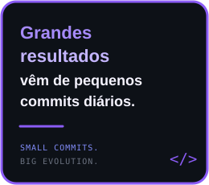
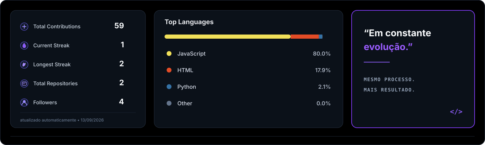
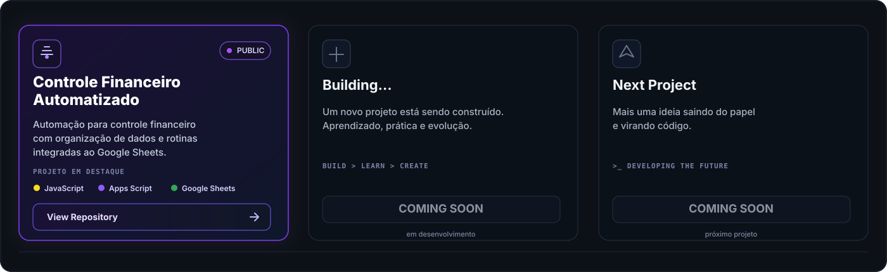
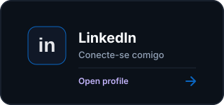
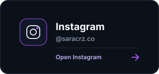
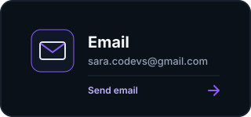
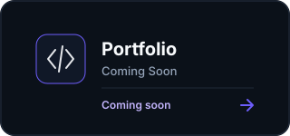
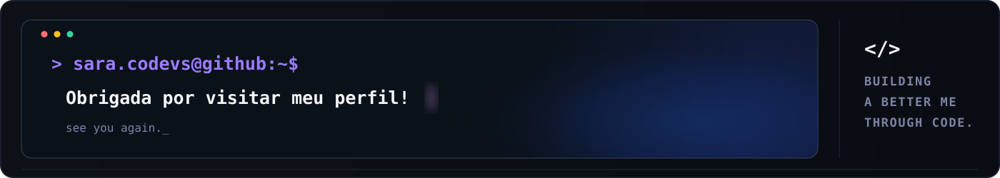

  

<h2>💜 About Me</h2>

<table>
<tr>

<td width="40%" valign="top">
<h3>Hi, I'm Sara 👋</h3>

Software Developer em formação, criando projetos reais,
aprendendo todos os dias e transformando ideias em soluções.

Aqui você encontra um pouco da minha evolução,
estudos e dos projetos que estou construindo.

</td>

<td width="32%" valign="top">

☕ Atualmente estudando <b>Java</b>

🟣 Explorando <b>Web Development</b>

🎨 UI/UX e prototipação com <b>Figma</b>

🚀 Construindo projetos do mundo real

</td>

<td width="28%" valign="middle" align="center">

</td>

</tr>
</table>
<h2>⚡ Tech Stack</h2>

<table>
<tr>

<td align="center" width="90">

 
<b>Java</b>
</td>

<td align="center" width="90">

 
<b>JavaScript</b>
</td>

<td align="center" width="90">

 
<b>HTML5</b>
</td>

<td align="center" width="90">

 
<b>CSS3</b>
</td>

<td align="center" width="90">

 
<b>Git</b>
</td>

<td align="center" width="90">

 
<b>GitHub</b>
</td>

<td align="center" width="90">

 
<b>Figma</b>
</td>

<td align="center" width="90">

 
<b>VS Code</b>
</td>

</tr>
</table>
 

<h2>📊 GitHub Stats</h2>

  

  <picture>
    <source
      media="(prefers-color-scheme: dark)"
      srcset="./assets/snake/github-snake-dark.svg"
    />
    <source
      media="(prefers-color-scheme: light)"
      srcset="./assets/snake/github-snake-light.svg"
    />
    
  </picture>

<h2>🚀 Featured Projects</h2>

  

<h2>🤝 Let's Connect</h2>

  

