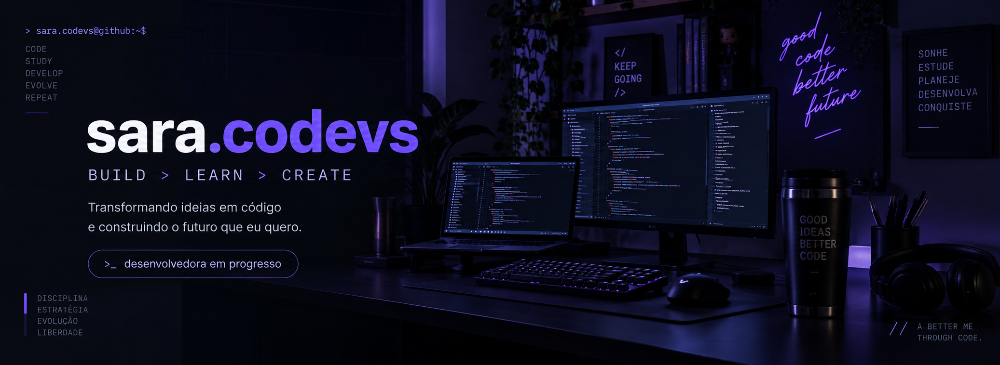

  

<h2>💜 About Me</h2>

<table>
<tr>
<td width="46%" valign="top">
<h3>Hi, I'm Sara 👋</h3>

Software Developer em formação, criando projetos reais, aprendendo todos os dias e transformando ideias em soluções.

Aqui você encontra um pouco da minha evolução, estudos e dos projetos que estou construindo.

</td>
<td width="34%" valign="top">

🟪 Atualmente estudando <b>Java</b>

🟣 Explorando <b>Web Development</b>

🎨 UI/UX e prototipação com <b>Figma</b>

🚀 Construindo projetos do mundo real

</td>
<td width="20%" valign="middle" align="center">

<b>Grandes resultados vêm de pequenos commits diários.</b>

────

</td>
</tr>
</table>

<h2>⚡ Tech Stack</h2>

  

 
